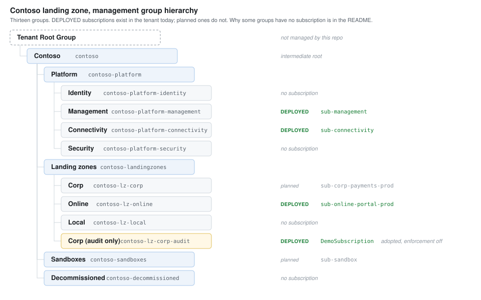
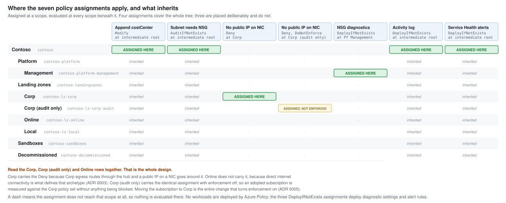
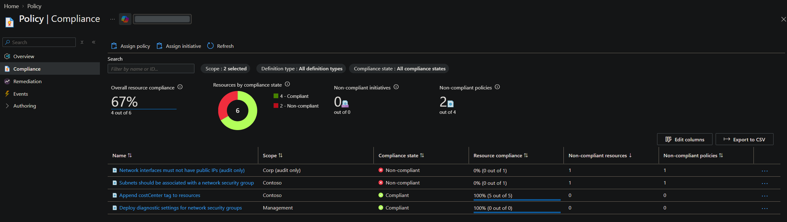
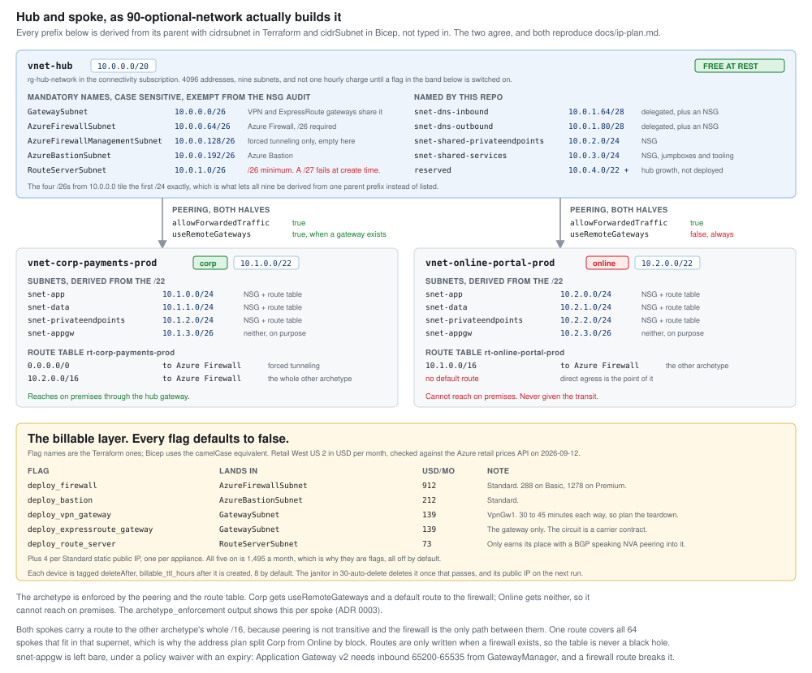
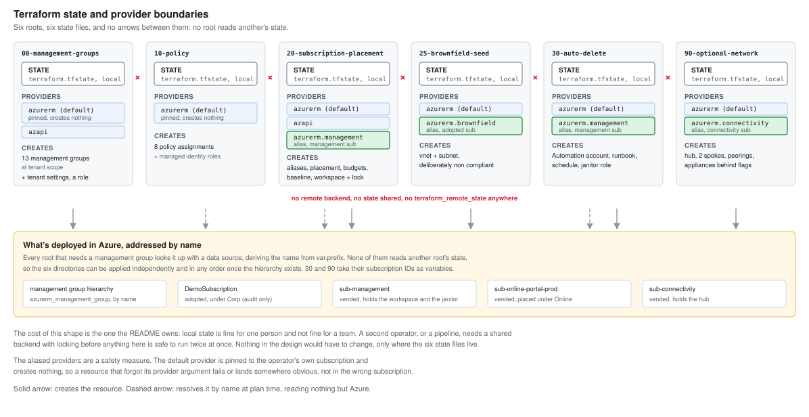

# Azure landing zone reference

An Azure landing zone in Terraform, plus the architecture decision records
explaining why it's shaped the way it is. It runs in my personal tenant. It's a
reference and a learning artifact rather than a production deployment, and I've
tried to be specific below about what's in it and what isn't.

The same landing zone is also written in Bicep, in [`bicep/`](bicep/). Same
hierarchy, same five assignments, same ADRs. It's there because writing the
decisions twice is the cheapest way to find out which parts of the Terraform
were architecture and which parts were Terraform, and
[bicep/README.md](bicep/README.md) is a list of everything that turned out to
be the second kind. The Terraform is the copy that's deployed; the Bicep
compiles, lints and scans in CI and has never been applied to the tenant. All
four of its roots have been run through `what-if` against the live estate: the
management group hierarchy comes back identical and all five policy assignments
match, which is the real evidence that the two trees describe the same thing.
The four defects that found, and every remaining difference, are in
[bicep/README.md](bicep/README.md#what-if-against-the-deployed-estate).

## Layout

```
terraform/     the deployed copy. Numbered roots, plus modules/
bicep/         the same landing zone again. Same numbering, same modules/
docs/adr/      the seven decisions, which describe both
docs/evidence/ portal screenshots, all from the Terraform copy
runbooks/      operational procedures, tool independent
scripts/       the CI checks, shared by both pipelines
```

Both trees are named after their language rather than one of them being the
default. That's the whole reason `terraform/` isn't called `infra/`: with two
implementations in the repo, an unlabelled directory is a guess.

## Hierarchy



The tree hangs off an intermediate root (`contoso`) instead of sitting directly
under the tenant root group, so existing subscriptions can be moved in and the
structure reorganised later without touching tenant root.

Corp, Online and Local are workload archetypes. They aren't environments and
they aren't business units. Environments are subscriptions inside an archetype,
which is what ADR 0002 is about.

## Architecture decision records

The decisions are the part I care about here. The Terraform is what lets you
check I actually deployed what I described.

| ADR | Decision |
|---|---|
| 0001 Platform subscription split | Four platform subscriptions, kept. What that costs to operate, and the trigger that would make collapsing Security into Management defensible. |
| 0002 Environments as subscriptions | Dev, test and production are subscriptions inside one archetype management group. Per environment policy gets handled with Audit at the archetype instead of separate management groups. |
| 0003 Archetype placement criteria | It comes down to one question: does the workload need routed connectivity to on premises through the hub. Internet exposure isn't that question. |
| 0004 Hub and spoke versus Virtual WAN | Hub and spoke here, for a cost reason that doesn't generalise. Microsoft's selection criteria, including the 30 tunnel threshold, are recorded as what a real estate should apply instead. |
| 0005 Brownfield adoption, audit only | Adopted subscriptions land in a duplicated archetype with enforcement off, and move across when compliance is good enough. Defines what "good enough" means, since Microsoft leaves that open. |
| 0006 Private DNS ownership | Platform owned, in the Connectivity subscription. Untangles a real contradiction inside one Microsoft article, and lists the five questions that settle it for a given estate. |
| 0007 Not using the accelerator | Why this repo hand rolls what the landing zone accelerator would generate, and what that costs. |

All seven are marked Accepted. Two questions are left open in the text rather
than answered with something I made up: whether data classification deserves
its own archetype from day one (0003), and what should qualify a subscription
for a single subscription exception (0002).

## What's actually deployed

| Area | State |
|---|---|
| Management groups | 13, counting the intermediate root and the audit only Corp duplicate |
| Policy assignments | 5 live, covering all five effects |
| Subscriptions | 3. One adopted brownfield, plus `sub-management` and `sub-online-portal-prod` vended through Terraform. `connectivity` and `corp-payments-prod` are in the vending map but not created |
| Log Analytics | One workspace in the management subscription, 30 day retention, 0.1 GB daily cap |
| Budgets | On every subscription, actual and forecast thresholds |
| Compliance | Evaluated. 4 compliant, 2 non compliant, both on purpose |
| Hub and spoke network | Written, not deployed. The free layer costs nothing at rest, see below |

### Policy, and why there are only five

Five assignments I can each explain, rather than the accelerator's several
hundred that I couldn't defend one at a time.

| Effect | Assignment | Scope |
|---|---|---|
| Modify | Append `costCenter` tag | intermediate root |
| AuditIfNotExists | Subnets should have a network security group | intermediate root |
| Deny | Network interfaces must not have public IPs | Corp only |
| DoNotEnforce | The same Deny, enforcement off | Corp (audit only) |
| DeployIfNotExists | Network security group diagnostics to the central workspace | Platform Management |



Inheritance shows up through the scopes. Modify and Audit apply everywhere. The
Deny only applies to Corp, because Corp workloads route egress through the hub
and a public IP on a network interface goes around that path. Online doesn't
carry it, since direct internet connectivity is the whole point of that
archetype.

Nothing gets deployed through Azure Policy. Microsoft's guidance is a flat no
on that, and doing it would undercut what this repo is for anyway.

### Brownfield adoption

`DemoSubscription` predates all of this. It sits under `Corp (audit only)`,
which is a duplicate of the Corp archetype carrying the same policy assignments
with `enforcementMode` set to `DoNotEnforce`.

So it gets evaluated against the Corp policy set, Deny included, and none of it
bites. You can measure compliance without putting anything that's running at
risk. Moving that one management group association over to Corp is the entire
change needed to start enforcing, and no policy gets rewritten. It costs
nothing extra, because what's duplicated is the hierarchy and the assignments,
not the workloads.

### The non compliant resources are on purpose

`terraform/25-brownfield-seed` creates resources that break the policy set
deliberately. Without them the audit only assignment reports nothing at all,
since an empty subscription has nothing to evaluate, and the whole pattern
looks broken when it's really just inapplicable.

A subnet with no network security group trips the `AuditIfNotExists` at the
intermediate root. A network interface carrying a public IP trips the Deny
assigned at Corp, and because the subscription sits under Corp (audit only) it
got **created successfully and recorded as non compliant**. Under Corp the same
call gets refused.

In a real adoption these violations already exist and nobody has to create
them.

The public IP was the only billable thing in the platform, around 3.60 USD a
month, and it was destroyed once the compliance evidence was captured. So the
subnet without a network security group is the violation that's still live.

### Evidence



The first two rows go together. `Network interfaces must not have public IPs
(audit only)` reports a violation at Corp (audit only): the network interface
carrying a public IP was **created successfully and recorded as non
compliant**. The identical assignment at Corp, with enforcement on, refuses
that call outright.

That network interface and its public IP are gone now. A Standard static public
IP is the only resource here that bills by the hour, so it got destroyed once I
had the screenshot. Same deploy, screenshot, destroy approach as the network
stack.

The third row is the Modify effect. Five resources are compliant with the
`costCenter` requirement and the Terraform that created them never set the tag.

The hierarchy screenshot is at
[docs/evidence/hierarchy-portal.png](docs/evidence/hierarchy-portal.png).

Both screenshots were captured on 6 and 7 September 2026. The hierarchy has not
changed since, which the Bicep what-if in
[bicep/README.md](bicep/README.md#what-if-against-the-deployed-estate)
independently confirms: 13 groups, no differences.

## Constraints

**Empty management groups.** `Identity`, `Security`, `Local` and
`Decommissioned` are in the tree with no subscriptions under them. In a real
tenant Identity holds domain controllers, Security holds Sentinel and the SIEM
tooling, Local holds Azure Local clusters, and Decommissioned holds cancelled
subscriptions through their retention window. They're empty here because this
is a personal billing account and every subscription costs real money to keep
around.

**Subscription limits.** This runs on a Microsoft Customer Agreement billing
account. Microsoft doesn't publish a subscription cap or a per day creation
limit for MCA, so I'm not claiming one. The "five subscriptions, one per day"
figure that gets repeated everywhere is Microsoft Online Services Program
behaviour and doesn't apply to this account. The real limit is that each
subscription is another thing to pay for and clean up.

**Hub and spoke network.** Written in both trees now, in
`terraform/90-optional-network` and `bicep/90-optional-network`, from the worked
address plan in [docs/ip-plan.md](docs/ip-plan.md). It splits in two:

- The **free layer** is the hub and spoke virtual networks, every subnet the
  plan calls for, the peerings, network security groups and route tables. None
  of that carries an hourly charge, so it can be left deployed. A plan of it
  reports 0 dollars a month.
- The **billable layer** is the firewall, the gateways, Bastion and Route
  Server. Every one is behind its own flag, all default to false, and each flag
  names its own price. All five plus their public IPs is 1,495 a month,
  which is why they go up on demand and come down the same day. ADR 0004
  carries the reasoning.



Neither layer is deployed right now. Both plan and what-if clean against the
tenant.

The only virtual network up right now is the deliberately non compliant one
described above.

**Terraform state is local.** Fine for one person on a lab, not fine for a
team. A shared backend with locking would be needed the moment a second person
or a pipeline touched this.

## What's hand written and what isn't

"I used the accelerator" and "I composed this" are pretty different claims, so
to be specific:

**Hand written:**

- The management group hierarchy (`terraform/00-management-groups`). Every group
  and parent relationship sits in one file. The Azure Verified Modules ALZ
  pattern module would generate this and a good deal more, and for a real
  tenant that's the right choice. For this I wanted the tree readable.
- The policy assignments and where they're scoped (`terraform/10-policy`).
- Subscription vending and placement (`terraform/20-subscription-placement`).
- Three local modules in [`terraform/modules/`](terraform/modules/): `policy-assignment`,
  `subscription-budget` and `subscription-vending`. The rule I used for pulling
  them out, and the one place I broke it, are in
  [terraform/modules/README.md](terraform/modules/README.md).
- All of the above again in [`bicep/`](bicep/), including the same three
  modules in [`bicep/modules/`](bicep/modules/). Where a Bicep file exists that
  has no Terraform counterpart it's because a Bicep module is the only way to
  change deployment scope, and [bicep/modules/README.md](bicep/modules/README.md)
  says which files those are.

**Not used:** `Azure/avm-ptn-alz/azurerm`, `Azure/ALZ-Bicep`, or the landing
zone accelerator. That's a decision rather than an oversight and ADR 0007
records it.

Short version: five policy assignments here against the accelerator's several
hundred, so what this shows is the mechanics, not a governance baseline. I hand
rolled it to understand how the pieces fit before deploying a prebuilt set. For
a real tenant the accelerator is the right answer.

**Built in policy definitions** wherever they exist, rather than custom ones. I
read their IDs, allowed effects and required roles off the platform with
`az policy definition show` rather than taking them from a blog post. Two
things that turned up doing that are recorded in comments at the call sites.
The subnet network security group built in only permits `AuditIfNotExists` or
`Disabled`, so it can't be the Deny example it usually gets presented as. And
the tagging Modify built in wants Contributor rather than Tag Contributor for
its managed identity.

## Deploying

[runbooks/deploy-and-destroy.md](runbooks/deploy-and-destroy.md) is the
step-by-step version of this section and the next one, for both
implementations, including the two stages you have to run twice and what
happens when you try to tear it all down.

Directories are numbered in deployment order. Each one is an independent root
module with its own state, and resolves management group scopes by name instead
of reading another directory's state, so there's no shared backend and no
ordering hidden away in state files.



The arrows that aren't there are the ones that matter. Nothing reads another
root's state, and the aliased providers exist so that a resource which forgot
its `provider` argument can't quietly land in the wrong subscription.

```bash
cd terraform/00-management-groups
cp terraform.tfvars.example terraform.tfvars   # fill in tenant, subscription, prefix
terraform init
terraform plan -out=tfplan
terraform apply tfplan
```

Then `terraform/10-policy`, then `terraform/20-subscription-placement`, the same way.

Always `plan -out` and apply the saved plan. Mostly that guards against a `.tf`
file changing between when you read the plan and when you type yes.

Subscription creation sits behind `create_subscriptions` rather than just
happening on an apply, because it's a billing account operation.

The Bicep equivalents are `az deployment mg|tenant|sub create`, one scope per
directory, which is the thing that doesn't carry across at all. Two of the four
run at management group scope, one at tenant, one at subscription, and which is
which is a permissions decision as much as a technical one.
[bicep/README.md](bicep/README.md) has the commands and the reasoning.

## Destroying

```bash
cd terraform/20-subscription-placement && terraform destroy
cd ../10-policy                    && terraform destroy
cd ../00-management-groups         && terraform destroy
```

Reverse order. Nothing in the deployed set bills more than trivial amounts, so
this is hygiene rather than cost.

That command fails on `20-subscription-placement` if you vended subscriptions,
which is deliberate and is dealt with in
[the runbook](runbooks/deploy-and-destroy.md#terraform-destroy-on-20-will-fail-by-design).

`azurerm_subscription` has `prevent_destroy` on it. Destroying it cancels the
subscription, and I didn't want a `terraform destroy` quietly cancelling a
platform subscription. Removing one is a deliberate act done outside this
workflow.

## Validation

[](https://github.com/robertrussell-dev/azure-landing-zone-lab/actions/workflows/validate.yml)

That badge is GitHub Actions. The Azure Pipelines run can't show a public
badge, because public projects in Azure DevOps are retired and the policy that
permits them isn't available to organisations not already using it. So that
pipeline is only verifiable to someone with access to the project.

Two CI definitions run the same checks, `azure-pipelines.yml` and
`.github/workflows/validate.yml`. The checks themselves live in `scripts/`, so
the two can't drift in what they verify. Neither holds an Azure credential.

Both trees are checked. Terraform gets `fmt`, `validate` and tflint; Bicep gets
a format check, `build`, `build-params` on the committed example parameter
files, and `bicep lint`. checkov scans both, and scans the Bicep as compiled
ARM JSON rather than as Bicep, for a reason worth reading before copying the
approach: [bicep/README.md](bicep/README.md#validation).
[docs/ci-security.md](docs/ci-security.md) has the threat model, the forked
pull request settings, and the workload identity federation design I'd use if
CI ever needed Azure access.
