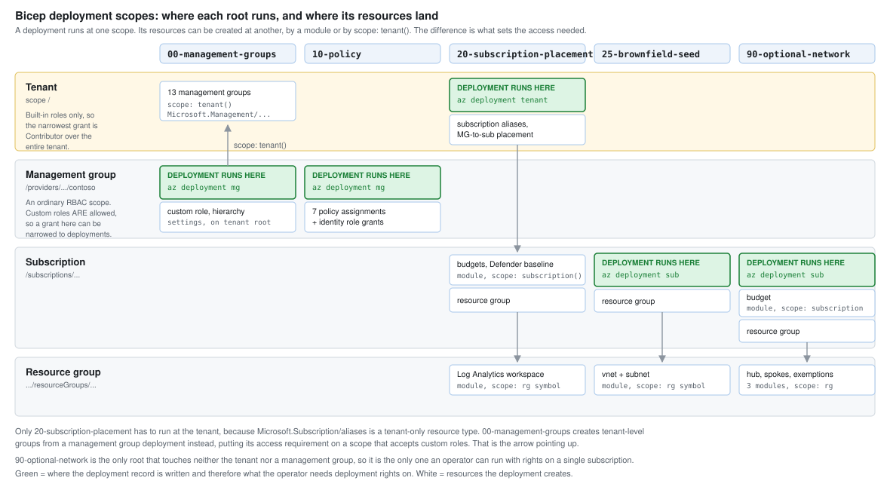
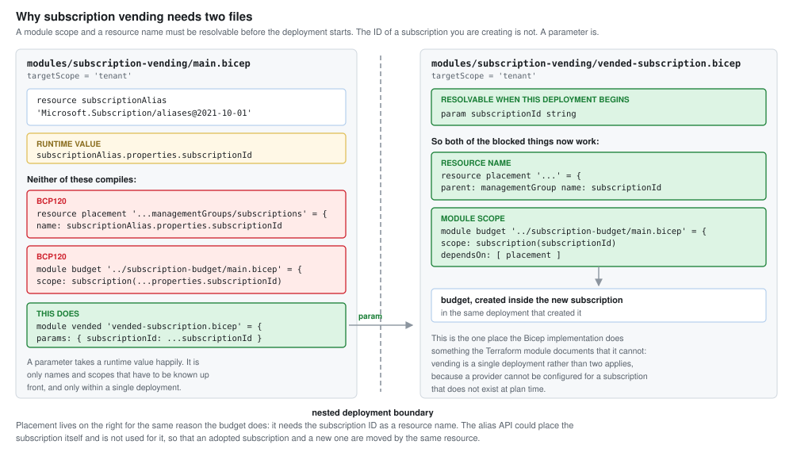

# The same landing zone, in Bicep

Everything in [`terraform/`](../terraform/), written again in Bicep. Same hierarchy,
same five policy assignments, same brownfield adoption pattern, same ADRs. The
architecture decisions in [`docs/adr`](../docs/adr/) describe this tree as
accurately as they describe the Terraform one, because none of them turned on
the tool.

It exists for one reason: the decisions are the point of this repository, and
writing the same decisions twice is the cheapest way to find out which parts of
the Terraform version were architecture and which parts were Terraform.

Some of it was neither, which is the interesting bit. Those are collected in
[What's actually different](#whats-actually-different).

## Layout

Directories are numbered in deployment order and match `terraform/` one for one.

| Directory | Scope | What it does |
|---|---|---|
| [`00-management-groups`](00-management-groups/) | management group | The 13 group hierarchy. The groups are tenant resources; only the deployment runs lower. |
| [`10-policy`](10-policy/) | management group | The five policy assignments. |
| [`20-subscription-placement`](20-subscription-placement/) | tenant | Brownfield placement, budgets, vending, the central workspace. |
| [`25-brownfield-seed`](25-brownfield-seed/) | subscription | The deliberately non compliant resources. Read its header before assuming it's a mistake. |
| [`modules`](modules/) | n/a | The three reusable child modules. |

Every root is independent and resolves management group scopes by name, so
there's no state to share and no ordering hidden anywhere but the directory
numbers.

The scope column is the thing that has no Terraform equivalent, so it gets a
picture:



## Deploying

Each root takes a `.bicepparam` file. Copy the committed example, which is a
real parameter file rather than sample text - CI compiles the examples against
their templates, so a renamed parameter breaks the build rather than turning up
at deployment time.

```bash
cd bicep/00-management-groups
cp main.example.bicepparam main.bicepparam   # fill in prefix and display name

# The tenant root management group's ID is the tenant ID.
MG=$(az account show --query tenantId -o tsv)

az deployment mg what-if \
  --management-group-id "$MG" \
  --location westus2 \
  --template-file main.bicep \
  --parameters main.bicepparam

az deployment mg create \
  --management-group-id "$MG" \
  --location westus2 \
  --template-file main.bicep \
  --parameters main.bicepparam
```

That is a management group deployment creating tenant level resources, which
is deliberate and is explained in the file header and in
[Scope replaces the provider](#scope-replaces-the-provider). Any management
group the operator can deploy to works, not only the tenant root: targeting
`contoso` gives the identical result. The tenant root is what the command
above uses because it is the only one guaranteed to exist before the
hierarchy does.

Then the rest, each at its own scope:

```bash
az deployment mg create --management-group-id contoso --location westus2 \
  --template-file bicep/10-policy/main.bicep --parameters bicep/10-policy/main.bicepparam

az deployment tenant create --location westus2 \
  --template-file bicep/20-subscription-placement/main.bicep \
  --parameters bicep/20-subscription-placement/main.bicepparam

az deployment sub create --subscription <brownfield GUID> --location westus2 \
  --template-file bicep/25-brownfield-seed/main.bicep \
  --parameters bicep/25-brownfield-seed/main.bicepparam
```

**Always what-if first.** It's the closest thing to `terraform plan -out` and
it isn't the same thing: what-if predicts, it doesn't produce an artefact you
then apply. Between the what-if and the create, the file can change and nothing
notices. The Terraform side guards that by applying a saved plan. There's no
equivalent here, so the gap is real and shrinking it means keeping the two
commands adjacent.

`what-if` at tenant and management group scope needs the same access the
deployment does, so it isn't a way to preview something you can't yet run.

**`az deployment` compiles with the Azure CLI's own Bicep, not the pinned one.**
That matters more than it sounds: resource type schemas ship inside the
compiler, so an older bundled version silently stops validating newer types.
Running the commands above against a CLI carrying Bicep 0.39.26 produces

```
Warning BCP081: Resource type "Microsoft.Network/virtualNetworks@2025-09-01"
does not have types available. Bicep is unable to validate resource properties
prior to deployment, but this will not block the resource from being deployed.
```

which is CI checking something the deployment doesn't. Either bring the CLI's
copy up to the version in [`scripts/install-bicep.sh`](../scripts/install-bicep.sh)

```bash
az bicep install --version v0.47.16
```

or build with the pinned binary and deploy the JSON. Don't ignore the warning:
it means the properties in that resource went unchecked.

**Check the tenant before the first one.** `00-management-groups` outputs
`deployedToTenantId` for this. See
[No tenant pin](#no-tenant-pin-in-configuration) for why that output exists at
all.

## Destroying

There isn't a `bicep destroy`, and this tree deliberately doesn't try to fake
one.

- Complete mode deletes what a template doesn't declare, but it's
  [resource group scoped only](https://learn.microsoft.com/azure/azure-resource-manager/templates/deployment-modes)
  and Microsoft is deprecating it. Nothing here is at resource group scope
  except the seeded network and the workspace.
- [Deployment stacks](https://learn.microsoft.com/azure/azure-resource-manager/bicep/deployment-stacks)
  are the supported answer and do work at every scope. Adopting them is a real
  decision - `denySettings` changes who can touch a managed resource outside
  the stack - and it isn't made here.
- So: `az group delete`, `az policy assignment delete`, `az account management-group delete`,
  bottom up, same order as the Terraform destroy.

Nothing in the deployed set bills more than trivial amounts, so this is hygiene
rather than cost. The one exception is the subscription alias, and cancelling a
subscription is a deliberate act performed outside this workflow either way.

## What's actually different

Everything below survived the exercise. It's the part that wasn't in the ADRs,
because none of it is an architecture decision.

### Scope replaces the provider

The azurerm provider is a connection: pin a subscription and a tenant to it and
reach whatever you have rights to, management groups included. A Bicep
deployment has a scope instead, every `resource` in a file has to belong to
that scope, and a module is how you cross a boundary.

That reshapes the tree, and the reshaping is not always forced.

`20-subscription-placement` is a **tenant** deployment and can't be anything
else, because `Microsoft.Subscription/aliases` is a tenant only resource type.
It needs the deploying principal to hold Owner or Contributor at `/`.

`00-management-groups` looks like it should be the same, since management groups
are tenant resources too. It isn't. A resource can carry `scope: tenant()` from
a deployment running lower down, so that directory is a **management group**
deployment that creates tenant level groups. The groups land in the same place
either way; only the deployment record moves.

That distinction is worth more than it sounds. Root scope `/` takes built in
roles only, so the narrowest thing grantable there is Contributor over the whole
tenant. A management group is an ordinary RBAC scope that takes custom roles, so
the same work can be authorised with `Microsoft.Resources/deployments/*` and
`Microsoft.Management/managementGroups/*` and nothing else. One of those is a
grant you can scope and the other isn't.

None of this is theoretical. The account that built this hierarchy through
Terraform couldn't run a what-if against it in Bicep until the
[permission wall](#the-permission-wall-and-what-was-done-about-it) was dealt with, and
after the restructure only one of the two roots still needs a grant to get
past it.

It also means a file can be a module for a reason that has nothing to do with
reuse. `20-subscription-placement/management-logs.bicep` exists because a
resource group is a subscription level resource and the workspace inside it
isn't. One caller, never more, still a separate file. The two caller rule in
[modules/README.md](modules/README.md) governs what lands in `modules/`, not
what gets split.

### No tenant pin in configuration

`terraform/00-management-groups/providers.tf` pins `tenant_id` and
`subscription_id` deliberately, so that an operator holding credentials for
more than one tenant can't send an apply to the wrong one with a stray
`az account set`.

Nothing in a Bicep file can do that. The scope comes from the CLI and the
signed in context, and the template has no say. The closest available guard is
the `deployedToTenantId` output, which surfaces the answer in a what-if before
the create - a check you have to read rather than one that stops you. This is a
straightforward loss and it's worth naming as one.

### There is no state, and that cuts both ways

The Terraform README lists local state as a constraint: fine for one person,
not fine for a team, and a shared backend with locking would be needed the
moment a second person or a pipeline touched it. That constraint doesn't exist
here. There's nothing to store, nothing to lock, nothing to leak.

What goes with it:

- **No drift detection.** Terraform tells you when reality stopped matching the
  configuration. Nothing here does. `what-if` compares the template against
  reality at the moment you ask, which is a check you run rather than a check
  that runs.
- **No destroy**, per the section above.
- **No `moved` blocks, and nothing to review.** ARM identifies a resource by
  type, name and scope, so extracting a module doesn't change its identity. The
  whole class of destroy-and-recreate accident that `moved` blocks exist to
  prevent isn't reachable. The cost is that a Terraform `moved` block is a claim
  in the config that a reviewer can check; here the refactor leaves no trace.
- **No `ignore_changes`**, which is the one that actually bites. See below.

### The Modify policy fight is silent instead of loud

`terraform/25-brownfield-seed` has a long comment about the `costCenter` tag: the
Modify assignment appends it, Terraform reads it back, doesn't find it in the
configuration, and plans to remove it. The plan is never clean until somebody
decides who owns the field, and `ignore_changes` is how that decision gets
written down.

The same disagreement exists here. An incremental deployment reapplies every
property, and
[properties not in the template are reset](https://learn.microsoft.com/azure/azure-resource-manager/templates/deployment-modes),
so a redeploy strips `costCenter` and the policy puts it back on the next
evaluation. Nothing reports it. There's no plan to be dirty and no
`ignore_changes` to settle it with.

Worse, not better. A visible argument you have to resolve beats an invisible
loop nobody notices.

### Two things Bicep does that Terraform can't

**Vending is one deployment, not two applies.** The Terraform
`subscription-vending` module documents that it can't create anything inside
the subscription it creates, because a provider needs a `subscription_id` at
plan time. Bicep hits the same wall - a resource name and a module scope both
have to be resolvable before the deployment starts - and can get past it, by
passing the ID one level down as a parameter. So placement and the budget
happen in the run that creates the subscription. The trick and the exact
compiler error are in
[`modules/subscription-vending`](modules/subscription-vending/).



**No wait before the role assignment.** The Terraform `policy-assignment`
module sleeps 30 seconds between creating a policy assignment's managed
identity and granting it roles, because the identity hasn't replicated yet and
the role assignment fails with `PrincipalNotFound`. This module doesn't. The
detail, including why that isn't simply "Bicep is better at this", is in
[`modules/policy-assignment`](modules/policy-assignment/).

### Small things that cost time

- A parameter named `description` shadows the `@description` decorator, and
  every decorator after it fails with an error that names the decorator. It's
  `policyDescription` here.
- No float literals. `dailyQuotaGb: 0.1` is a parse error;
  `json('0.1')` is the way.
- Loops are positional, not keyed. It doesn't matter, because ARM addresses a
  resource by name and reordering the array only reorders the deployment.
- Deployment names are capped at 64 characters, and the compiler warns when an
  interpolated one *might* exceed it rather than when it does. Hence the
  `take(...)` calls.
- `subnets` go inline on the virtual network, not in a child resource. Mixing
  the two makes alternating deployments overwrite each other, and Microsoft
  [says so explicitly](https://learn.microsoft.com/azure/azure-resource-manager/templates/deployment-modes).

## Validation

Same arrangement as the Terraform side: the checks live in
[`scripts/`](../scripts/) and both CI definitions call them, so the two can't
drift apart in what they verify. No Azure credentials anywhere.

| Script | What it does |
|---|---|
| `install-bicep.sh` | Pinned Bicep CLI. A pinned binary rather than `az bicep`, so there's one moving part instead of two. |
| `validate-bicep.sh` | Format check on tracked files, `bicep build` on every file, `bicep build-params` on every committed example. |
| `lint-bicep.sh` | `bicep lint`. Fails on any output, warnings included, because `bicep lint` exits 0 on warnings. |
| `scan-security.sh` | checkov, both trees. |

`bicep build` compiles offline - resource type schemas ship inside the CLI -
which is why the pinned version in `install-bicep.sh` decides what the build
actually checks against.

Linter rules, and written justifications for the two that are turned off, are
in [`bicepconfig.json`](bicepconfig.json). Same policy as `.checkov.yml`: a rule
that's off says why.

**checkov scans this tree as compiled ARM JSON, not as Bicep.** Its Bicep parser
can't read lambda expressions, and `modules/policy-assignment` uses `toObject`
with two of them to wrap policy parameters. Those files come back as parsing
errors and checkov exits 0 regardless, which is a gate reporting success while
covering nothing. Compiling first avoids the parser, scans what would actually
be deployed rather than what was written, and reaches 46 resources against the
Bicep parser's 24. `scan-security.sh` also fails the build on any parsing error,
because a file the scanner couldn't read is otherwise indistinguishable from a
clean one.

## What-if against the deployed estate

The Terraform tree is deployed in this tenant with `prefix = "contoso"`. Point
the Bicep at the same prefix and what-if compares the two, which is the closest
this repository gets to proving the translation is faithful without deploying
it.

All four roots have now been checked. Two of them needed a tenant root grant
to get there, which is its own finding and is
[recorded below](#the-permission-wall-and-what-was-done-about-it).

Between them the runs found four things worth fixing in this tree, and every
remaining diff is either understood or deliberate.

### 10-policy: all five assignments already exist and match

```
az deployment mg what-if --management-group-id contoso --location westus2 \
  --template-file bicep/10-policy/main.bicep --parameters bicep/10-policy/main.bicepparam
```

Every assignment resolved to the one Terraform created - same name, scope,
definition, parameters, enforcement mode, display name, description and
non-compliance message. Nothing to create and nothing to correct on any of the
five. That's the result worth having, and it's the only real evidence in this
directory that the two trees describe the same thing.

Two categories of diff came back, neither of them a translation error.

**`- properties.definitionVersion` on all five.** Covered in
[modules/policy-assignment](modules/policy-assignment/#notes). Short version:
Azure set those values itself, what-if can't model server-side defaults, and
the module now has a parameter for it that's deliberately left empty.

**Three role assignments reported as creates.** These aren't new grants. The
identities already hold those roles at those scopes; Terraform named its role
assignments with different GUIDs than
`guid(managementGroup().id, name, roleDefinitionId)` produces, so ARM sees a
resource that doesn't exist and plans to create it. Azure would then reject it
with `RoleAssignmentExists`, because a principal can't hold the same role twice
at the same scope.

Which is the concrete version of "the two trees collide": it isn't only that
management group names clash, it's that this deployment would fail partway
through on a role assignment. Worth knowing before anyone tries it.

### 25-brownfield-seed: three diffs, all understood

```
az deployment sub what-if --subscription <brownfield GUID> --location westus2 \
  --template-file bicep/25-brownfield-seed/main.bicep --parameters bicep/25-brownfield-seed/main.bicepparam
```

The resource group comes back `Nochange`. The virtual network reports three
property diffs:

| Diff | What it is |
|---|---|
| `- tags.costCenter: "lab"` | The Modify policy argument, live. See below. |
| `- properties.privateEndpointVNetPolicies` | Server-side default, same class as `definitionVersion`. Left alone rather than declared to silence a line. |
| `~ properties.defaultOutboundAccess: true => false` | Deliberate, and now set explicitly. |

A fourth one was a real defect and is fixed: the subnet declared
`addressPrefix` where the API returns `addressPrefixes`, so every what-if
reported a change that wasn't one. Terraform uses the plural and now so does
this.

`defaultOutboundAccess` is the interesting one. Nothing set it on either side -
the deployed subnet has `true` because the provider's API version defaults it
that way, and `2025-09-01` defaults it to `false`. An unrelated API version
bump would have silently changed egress behaviour on a subnet nobody touched.
It's declared explicitly now, with the reasoning at the call site.

**The costCenter diff is the section above, demonstrated.** what-if really does
print `- tags.costCenter: "lab"`, which corrects something this README said in
an earlier draft: the Modify policy argument isn't invisible in Bicep, it's
invisible *by default*. Terraform puts it in front of you on every plan. Here
it only appears if somebody runs what-if. That's still worse, and it's less bad
than silent.

### 00-management-groups: the whole hierarchy matches

```
az deployment mg what-if --management-group-id "$(az account show --query tenantId -o tsv)" \
  --location westus2 \
  --template-file bicep/00-management-groups/main.bicep --parameters bicep/00-management-groups/main.bicepparam
```

**13 resources, 13 `Nochange`.** Every management group Terraform built comes
back identical: the intermediate root, the four tier one groups, the four
platform children, the three archetypes and the audit only Corp duplicate. Name,
display name and parent all match. That is the strongest evidence in this
repository that the two trees describe the same hierarchy.

It didn't start that way. The first run reported one modification, on the one
group whose placement the ADRs actually argue about:

```
~ Microsoft.Management/ManagementGroups/contoso
  - properties.details:
      parent.id: ".../managementGroups/5fbdc2f4-..."
```

The intermediate root was declared without `details.parent`, on the correct
theory that omitting it places a group under the tenant root. The Terraform
version relies on the same default. But an omission is not a statement, and
against an existing group what-if reads it as removing the parent. Naming the
parent explicitly - the tenant root management group's ID is the tenant ID -
costs one line and makes the tree's most argued-over edge a declaration rather
than a default.

### 20-subscription-placement: three match, the budget disagrees

```
az deployment tenant what-if --location westus2   --template-file bicep/20-subscription-placement/main.bicep --parameters bicep/20-subscription-placement/main.bicepparam
```

The audit only Corp management group, the `rg-management-logs` resource group
and the `law-contoso-management` workspace all come back `Nochange`. The
brownfield placement was confirmed separately, by asking the management group
for its descendants rather than by reading what-if: `DemoSubscription` sits
under `contoso-lz-corp-audit`, which is what ADR 0005 describes.

The budget is the one modification, and two of its three diffs are worth
knowing.

**Notification keys are named by the tool, and the names are part of the
resource.** Terraform's provider generated
`actual_GreaterThan_80.000000_Percent`; this module uses `actual`. Same
threshold, same recipient, same effect, different key - so a deployment would
delete one and create the other. This is the map-versus-repeated-blocks
difference the [module README](modules/subscription-budget/) predicts, showing
up in practice. The generated name embeds the threshold, so it changes whenever
the threshold does, which is reason enough not to copy it.

**what-if can't evaluate the start date at all.** It prints the unresolved
expression:

```
~ properties.timePeriod.startDate: "2026-09-01T00:00:00Z" =>
    "[format('{0}T00:00:00Z', utcNow('yyyy-MM-01'))]"
```

`utcNow()` is evaluated at deployment time, so a preview cannot tell you
whether the date is about to change. Today it resolves to the value already
there and nothing moves. That is the concrete argument for pinning `startDate`
in the parameter file once a budget exists, which the module README already
recommends and this makes non-optional.

The third diff, `- properties.timePeriod.endDate`, is a server-side default
(Azure sets ten years out) in the same class as `definitionVersion` and
`privateEndpointVNetPolicies`.

### The permission wall, and what was done about it

Both roots initially failed, because both were tenant deployments at the time:

```
(AuthorizationFailed) The client '...' does not have authorization to perform
action 'Microsoft.Resources/deployments/whatIf/action' over scope
'/providers/Microsoft.Resources/deployments/main'
```

That is the bar from [Scope replaces the provider](#scope-replaces-the-provider)
arriving in practice. The account already held **User Access Administrator at
`/`**, from the Entra elevated access toggle, plus Owner on the intermediate
root: enough to build the entire hierarchy through Terraform, and not enough to
run a tenant deployment against it, because `Microsoft.Authorization/*` does not
include `Microsoft.Resources/deployments/*`.

There is no least-privilege fix at that scope. A custom role carrying only
`Microsoft.Resources/deployments/*` can't be assigned at `/`, because Azure
[forbids `assignableScopes` of `/` for custom roles](https://learn.microsoft.com/azure/role-based-access-control/custom-roles#custom-role-limits).
Only built-in roles reach root scope, and the narrowest one carrying that action
is Contributor over the entire tenant.

Two different things were done about it, and they are worth separating.

**`00-management-groups` stopped needing root scope at all.** It is now a
management group deployment whose groups carry `scope: tenant()`, the shape
Microsoft
[documents](https://learn.microsoft.com/azure/azure-resource-manager/bicep/deploy-to-management-group#management-group)
for principals that can't deploy at the tenant. The hierarchy it produces is
byte for byte what it produced before, verified by re-running the what-if: 13
resources, 13 `Nochange`, and the report still lists them at scope `/` because
that is genuinely where they live. Targeting the tenant root management group
and targeting `contoso` both give the identical result, so the deployment can
run from any management group the operator holds rights on.

What that buys is a scope that behaves like every other RBAC scope. The
narrow custom role that is illegal at `/` is legal at a management group, so
this directory can be authorised with `Microsoft.Resources/deployments/*` and
`Microsoft.Management/managementGroups/*` and nothing more. **That narrower
grant is described, not demonstrated.** The account here now holds Owner at `/`,
which satisfies every scope and therefore masks whether a tighter one would
have been sufficient. Proving it would mean giving the lab operator less access,
which is not a change worth making to produce a screenshot.

**`20-subscription-placement` still needs it.** `Microsoft.Subscription/aliases`
is tenant only and there is no equivalent escape, so this one is a tenant
deployment or it is nothing.

**Owner at `/` is assigned to the lab operator, deliberately and permanently.**
So is the elevated access it sits alongside. Both are recorded here rather than
left to be discovered, because a repository about governance should not have
undocumented standing access at tenant root. In a real estate neither would be
acceptable: Microsoft's guidance is that elevated access is temporary, and
standing Owner at `/` is the widest grant Azure offers. This is a single user,
two subscription personal tenant where the alternative is re-elevating for every
preview, and the trade was made with the cost known.

The honest summary is that the restructure halved the problem rather than
solving it. One root now sits at a scope you can reason about; the other still
requires the widest grant Azure has.

## What isn't here

**[ALZ-Bicep](https://github.com/Azure/ALZ-Bicep) isn't used**, for the same
reason `Azure/avm-ptn-alz/azurerm` isn't used on the Terraform side. ADR 0007
records that decision and it applies unchanged. Five policy assignments against
the accelerator's several hundred: what this shows is the mechanics, not a
governance baseline.

**This tree has never been deployed.** The Terraform in `terraform/` is what's
running in the tenant, and the evidence in [`docs/evidence`](../docs/evidence/)
came from it. "It builds" and "it deployed" are different claims and only one
of them is being made.

All four roots have been checked against the live estate with what-if, which is
a weaker claim than deployment and a much stronger one than compilation. The
hierarchy comes back identical, all five policy assignments match, and every
remaining difference is
[written up above](#what-if-against-the-deployed-estate) rather than left for
someone to rediscover.
