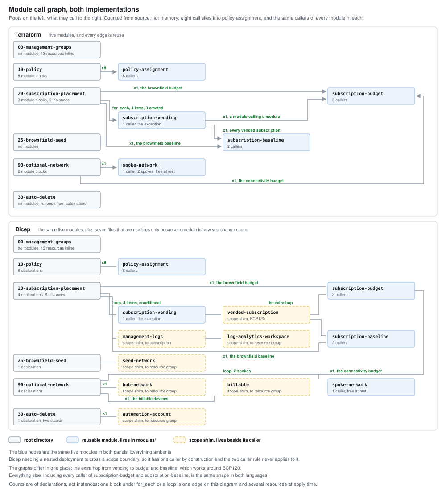

# Modules

Three of them. My rule is two callers before I pull anything out, and
`subscription-vending` doesn't meet it.

| Module | Callers | What it does |
|---|---|---|
| [`policy-assignment`](policy-assignment/) | 5 | Policy assignment at management group scope, and the role assignments its identity needs. |
| [`subscription-budget`](subscription-budget/) | 2 | Subscription budget, actual and forecast thresholds. |
| [`subscription-vending`](subscription-vending/) | 1 | Creates a subscription against a billing scope, places it, budgets it. Calls `subscription-budget`. |

## The two caller rule

One call site and I leave it inline.

A module wrapping a single resource doesn't buy you anything at one caller. You
still have to open it to see what it makes, so all you've added is a hop and a
list of variables to thread through. Usually the real reason for doing it is
that the repo looks more serious with a modules folder in it.

`terraform/00-management-groups` is the one I'd point at. Thirteen resources, one
caller, still a flat file. That directory is laid out the way it is so you can
read the whole tree without jumping around, and making it a module would undo
the only thing it has going for it.

Then there's `subscription-vending`, which has one caller and is a module
anyway. It's what an app team actually consumes, and every landing zone the
platform vends adds a caller, so that number only moves up. It also pins down
an ordering (create, then place, then budget) and the reason you can't deploy
into the subscription in the same apply, and I didn't want that inline in a
root module where nobody would find it. Although I am extracting on callers I
don't have yet, which is the thing I just finished saying not to do. It could
go either way.

## Interface stuff

`subscription_id` takes a bare GUID, not a resource ID. Everyone passes the
resource ID once, and the error you get back at apply time doesn't point at
what you did, so it's checked at the variable instead.

Budgets need at least one contact address. A budget with none plans and applies
perfectly happily and then alerts nobody.

`policy-assignment` creates the managed identity when you pass
`role_definition_ids`, and not otherwise. I didn't want a `create_identity`
boolean, because then there are two inputs that can contradict each other and
an Audit assignment can end up carrying an identity with nothing to do.

Comments say why rather than what. The `time_sleep` in front of the role
assignment is the one that matters. On its own it reads like something added to
get a flaky apply to pass, so the comment says it's the `PrincipalNotFound`
race and roughly how long the wait needs to be. Whoever reads it next can work
out whether it's still needed.

`subscription-vending` writes down what it can't do, mostly that it can't
create anything inside the new subscription. You can't configure a provider
against a subscription ID that doesn't exist yet at plan time.

## moved blocks

Both extractions planned `0 to add, 0 to change, 0 to destroy`.

Pulling a resource into a module changes its address, and Terraform reads that
as a destroy plus a create. For a budget that's fine. For `azurerm_subscription`
it's a cancellation, and `prevent_destroy` caught it twice while I was doing
this.

`terraform state mv` would get to the same place. I used `moved` blocks because
they sit in the config and turn up in the plan, so there's something to review.
